# AUDA

**An always-on autonomous digital operator.**

AUDA is not a chatbot. It is a persistent entity with its own computer, memory,
responsibilities and rules. It keeps working after the conversation ends,
notices relevant changes on its own, acts within the permissions you give it,
and comes back only when your judgment is actually needed.

> “Keep this server healthy and tell me when you need me.”
> — and then you close the tab, and AUDA keeps going.

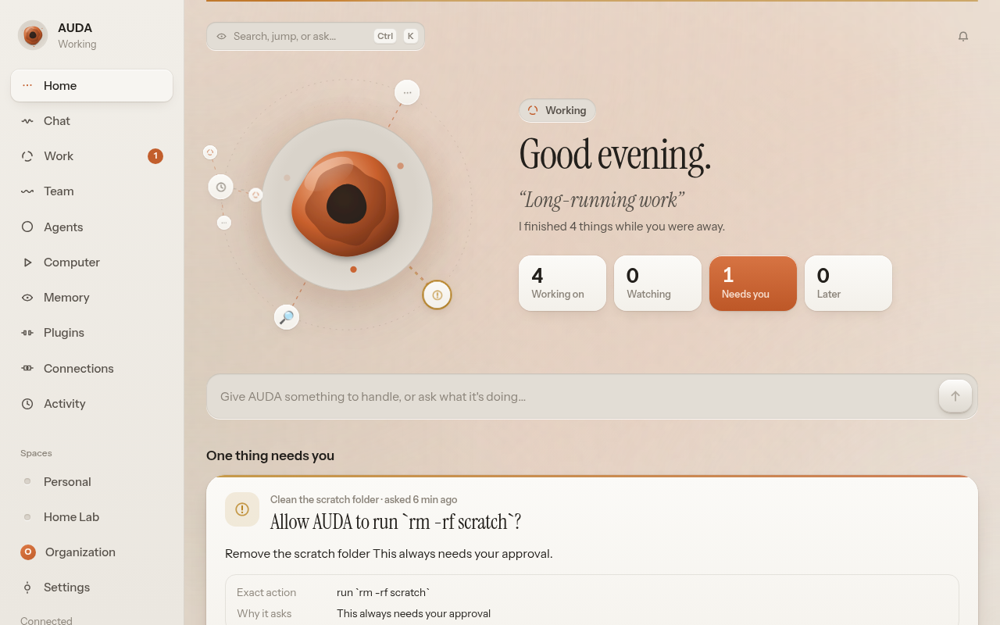

<sub>Every agent at work orbits AUDA's glyph — sub-agents as moons, the amber one is waiting for your decision. More in [Screenshots](#screenshots).</sub>

## What's here

This repository is a working vertical slice, not a mockup:

| | |
|---|---|
| **Presence** | A morphing glyph (“the Aperture”) and a one-sentence narration derived from what AUDA is actually doing — never a spinner. Every agent at work orbits it as a live satellite (sub-agents as moons); an ambient aurora follows AUDA’s mood; ceramic surfaces catch the light under your pointer. |
| **⌘K** | One palette to jump anywhere, find any task, agent, plugin or memory, run actions, ask AUDA, or hand work to an agent with `@name …`. |
| **Voice** | Hold Space (or tap the mic) and just say it. The glyph moves with your voice, your words appear as you speak, and AUDA answers on screen — and aloud, if you like. |
| **Wall mode** | `/wall` turns AUDA into a live display for a monitor across the room: the work constellation, what needs a person, what's running and watched, system health, a clock and an activity stream. The cursor hides when idle; `F` for fullscreen. |
| **While you were away** | Come back after a while and get the story in seconds: what got done, what needs you, what your agents learned, what AUDA recovered from on its own. |
| **Responsibilities vs tasks** | Ongoing goals (“keep demo-api healthy”) own watchers, schedules and triggers, spawn finite tasks, and return to *Watching* when a task ends. |
| **Durable task engine** | Leases, heartbeats, per-step checkpoints, retries with exponential backoff, crash recovery that resumes from the last completed step. |
| **Tool broker + policy engine** | Every side effect goes through capabilities with autonomy levels, natural-language rules compiled to policy, specific approval cards, idempotency keys and an audit log. |
| **AUDA's computer** | A persistent workspace with a terminal, filesystem, a real Chromium profile (live screencast in the UI), and one small service to look after. Watch it, take control, hand it back. |
| **Memory** | Typed memory (identity, preference, episodic, project, operational, semantic, relationship, procedural, working) with provenance, confidence, weight (*mentioned → established → defining*), expiry and consolidation. |
| **Scheduler & watchers** | Cron, intervals, one-offs and fuzzy windows (“tomorrow morning”); cheap edge-triggered watchers that wake responsibilities only on meaningful change. |
| **Supervisor** | An independent loop that detects dead task runs and a hung browser, and recovers them visibly. |
| **Connections** | AUDA's computer, inbound webhooks, GitHub (CI watching), Claude, and linked devices with explicit, revocable grants. |
| **Chat** | A control surface that maps language onto persistent state; created objects render inline and stay live. |
| **Organization** | Optional accounts, roles and one-time invites. Each person has their own chats, tasks, agents and plugin connections; admins supervise everything. |
| **Plugins** | External apps as agent tools — GitHub, Google Calendar/Drive/Gmail, Slack, Notion, Linear, any remote MCP server, any OpenAPI service. Everyone connects their own account over OAuth (PKCE); writes ask first. |
| **Custom agents** | One-click specialists from a sentence or a template, with a knowledge base (files, web pages it studies, notes), shareable with the organization. |
| **Learning** | Each agent learns from its work: a learned re-ranker over its knowledge, lessons and skills written after every task, and 👍/👎 feedback — all local. |
| **Real deliverables** | Agents do what you'd do at a computer, not just code: research the web and cite sources, then hand back a designed **PDF report** (cover, contents, charts), a **presentation** (PowerPoint with native charts and speaker notes, plus PDF and a full-screen web deck), a **Word** document, an **Excel** workbook with formulas and totals, or a chart. They read PDFs, decks, documents and spreadsheets too — and for code, they write it, run it and run the tests. Every file previews right in the UI. |

The whole product works **offline without any model** — the built-in playbooks
and intent compiler handle server health, page watching, CI, webhooks,
reports, reminders, rules and memory. Connect Claude to unlock open-ended work.

## Screenshots

| | |
|---|---|
| 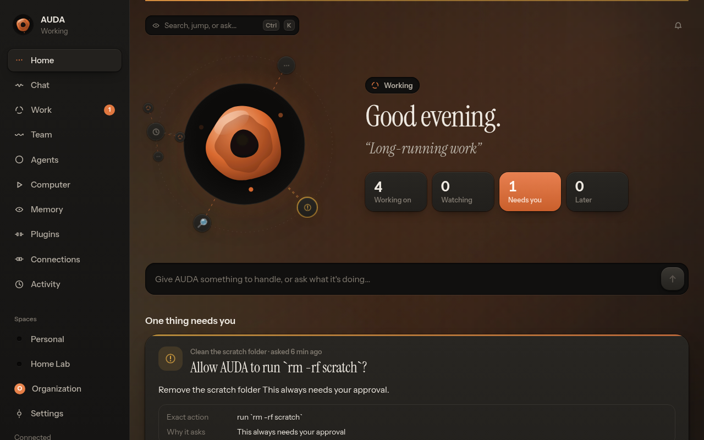 | 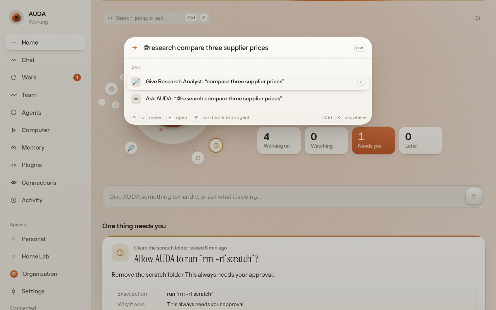 |
| **Home, dark.** The ambient light follows AUDA's mood. | **⌘K.** Jump anywhere, or hand work to an agent with `@name …`. |
| 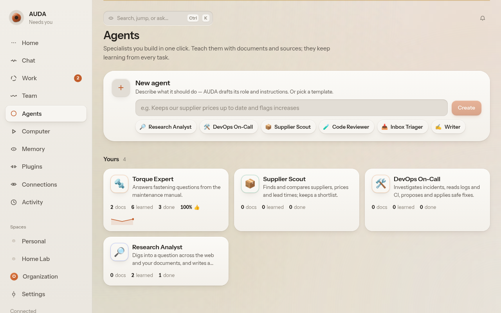 | 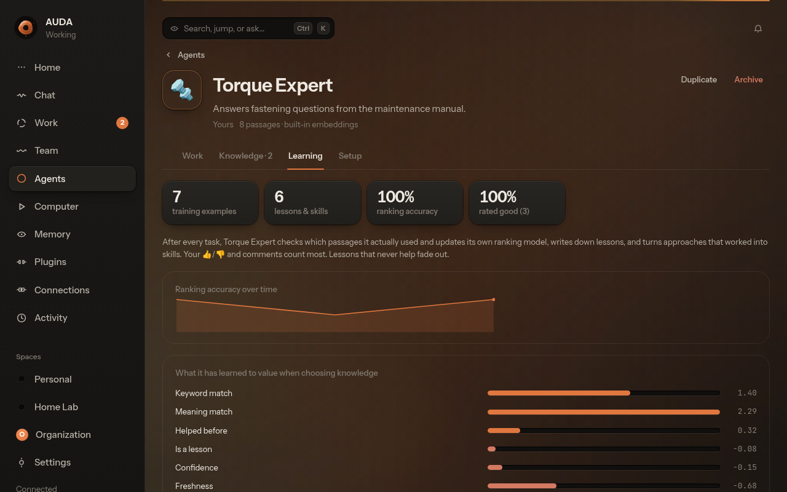 |
| **Agents.** One-click specialists from a sentence or a template. | **Learning.** What it has learned to value, its lessons, and how accurate its ranking is. |
| 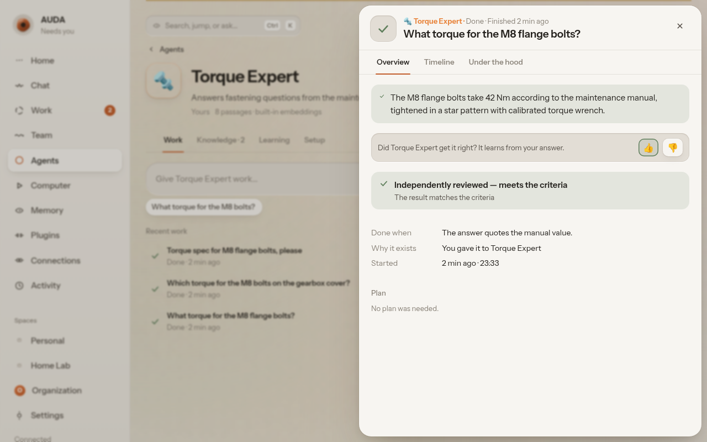 | 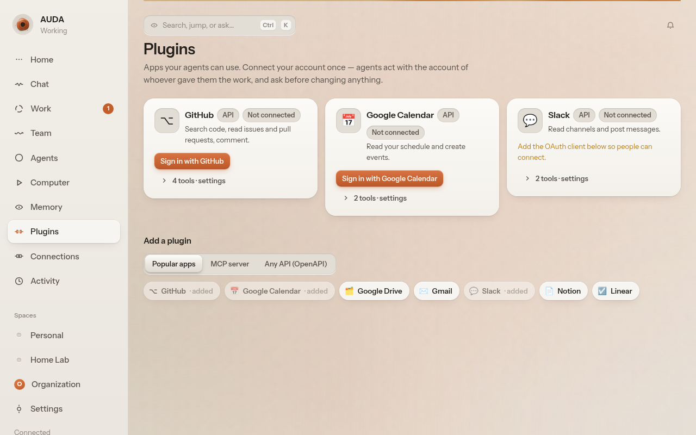 |
| **Feedback.** 👍/👎 and comments become training signal and lessons. | **Plugins.** Each person connects their own account; writes ask first. |

| 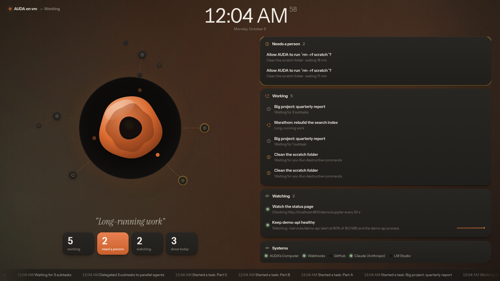 | 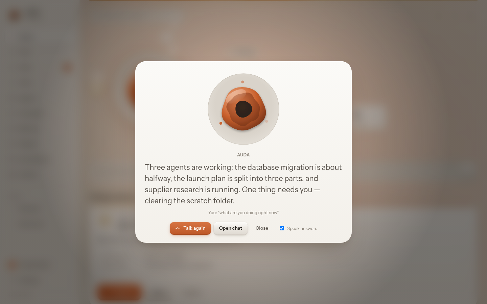 |
| **Wall mode.** Legible from across the room; the cursor hides when idle. | **Voice.** Hold Space, ask, hear the answer. |
| 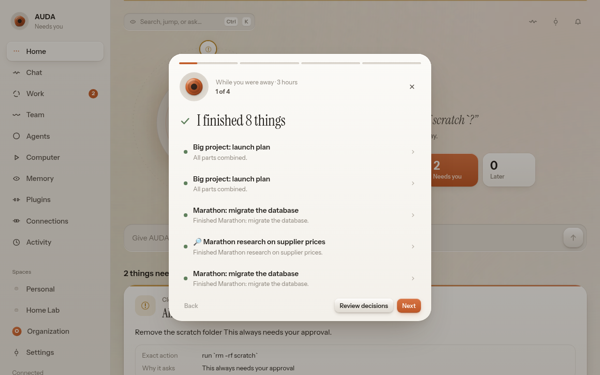 | 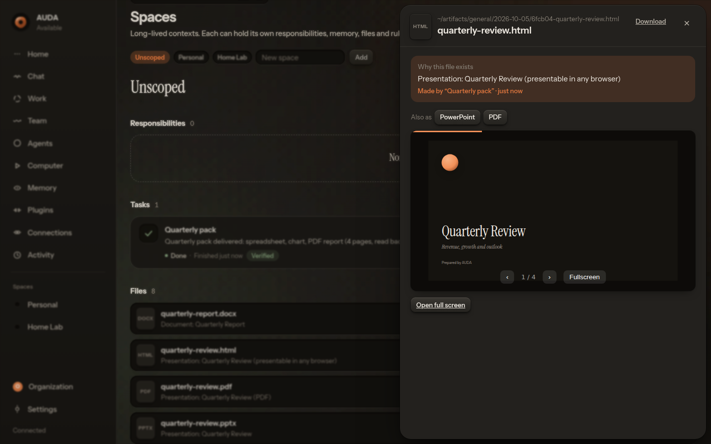 |
| **While you were away.** The story of your absence, in a few cards. | **Decks.** One deck as PowerPoint, PDF and a web deck you can present from the browser. |
| 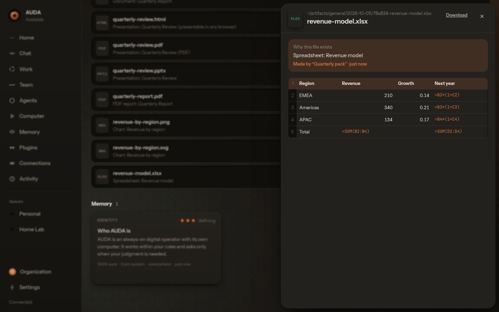 | |
| **Spreadsheets.** Real formulas and a totals row, previewed before you download. | |

<p align="center">
  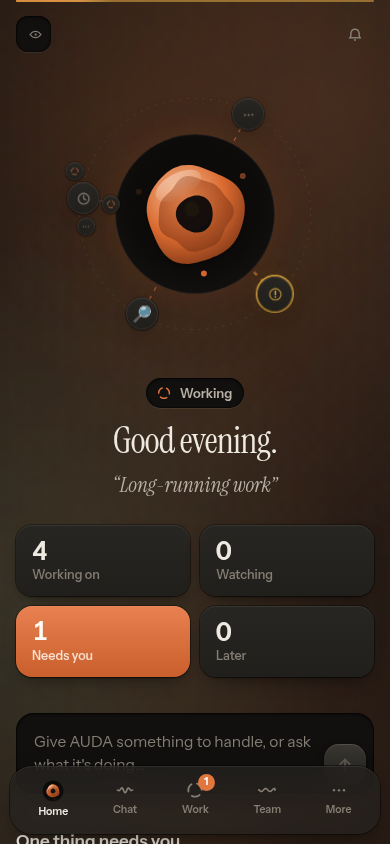
  &nbsp;&nbsp;
  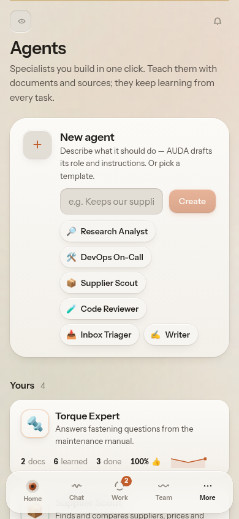
</p>

## Quick start

Requires Node.js ≥ 22.12 and (for the browser) Chromium.

```bash
npm install
npm run build        # build the UI
npm start            # AUDA core + process supervisor on http://localhost:4610
```

Development (hot reload for core and UI):

```bash
npm run dev          # UI on http://localhost:5173, API on :4610
```

### Try the vertical slice

1. In Chat (or the box on Home) say **“Keep the server healthy.”**
   AUDA creates a responsibility and starts watching `demo-api` on its own computer.
2. Open **Computer → Services** and switch `demo-api` to **debug** logging.
   The volume starts filling at ~450 KB/s; the gauge climbs on Home.
3. At 80% the watcher fires. AUDA investigates with real commands
   (`du`, `find`, growth sampling, `tail`, `cat config.json`), finds the cause and
   asks — once, specifically — whether it may delete old archives and switch logging back.
4. Approve. The card resolves, the task resumes, AUDA verifies the fix, writes an
   incident report, stores episodic + procedural memory and returns to **Watching**.
5. Switch to debug again: the next incident cites your earlier decision. After the
   second approval AUDA **suggests a rule** so it can handle it without asking next time.
6. **Computer → Reliability → Freeze the browser** to watch the supervisor recover it.

### Assign hard work

**Work → Assign work**: say what to do, add details, and — most importantly —
**done when**. AUDA publishes a live plan, splits independent parts across
parallel sub-agents, asks only for real decisions, and has the result
independently reviewed against your criteria before calling it finished.
(Open-ended work needs Claude connected; everything else works offline.)

### Tests

```bash
npm test               # unit tests: scheduler, rules, policy, broker idempotency, memory, reminders
npm run e2e:slice      # the vertical slice above, headless
npm run e2e:agent      # agent path with a scripted model: review/revise, sub-agents, loops, approvals, crash mid-command
npm run e2e:reliability# platform drills: DB corruption restore, poison quarantine, frozen-core watchdog, crash loop → safe mode
npm run e2e:lan        # LM Studio (faithful fake), discovery, pairing, uploads, team chat with @mentions
npm run e2e:org        # accounts + invites, OAuth/PKCE + refresh, MCP discovery/registration/SSE, shared agents, knowledge, learning
npm run e2e:office     # research → spreadsheet, chart, PDF report, deck (pptx/pdf/html), Word; reads its own PDF back
npm run e2e            # all of them
```

## Reliability

AUDA can't promise nothing ever fails; it is built so failures are expected,
detected, contained, recovered where safe, and explained when not — step time
budgets, error classification, idempotent actions, poison-task quarantine, an
event outbox, a watchdog with safe mode, automatic backups with corruption
restore, and agent guards (review before done, loop detection, context handoff,
output capping, untrusted content). The full matrix, with the test for each
defence, is in [`docs/ARCHITECTURE.md` §11](docs/ARCHITECTURE.md#11-reliability-model).
Live state: **Settings → Reliability**.

## Configuration

| Variable | Default | |
|---|---|---|
| `AUDA_DATA` | `./data` | Database, workspace, browser profile, secrets key |
| `AUDA_PORT` | `4610` | |
| `AUDA_PUBLIC_URL` | `http://localhost:4610` | Used for webhook URLs, invite links and the OAuth redirect URI (`…/api/oauth/callback`) |
| `AUDA_TOKEN` | — | Require a token for the UI and API |
| `AUDA_MASTER_KEY` | generated | Key for the encrypted secret store |
| `ANTHROPIC_API_KEY` | — | Optional; Claude can also be connected in the UI |
| `AUDA_CHROMIUM` | auto-detected | Chromium executable for AUDA's browser |
| `AUDA_COMPUTER_DRIVER` | `local` | `local` · `docker` · `ssh` |
| `LMSTUDIO_URL` | auto-detected | LM Studio server address(es), comma-separated |
| `AUDA_DISCOVERY` | on | Set `0` to stop advertising on the LAN |
| `AUDA_MAX_RSS_MB` | `2048` | Supervisor restarts the core gracefully above this |
| `AUDA_STEP_TIMEOUT_MS` | `600000` | Default time budget per task step |
| `AUDA_AGENT_MAX_TURNS` | `80` | Hard cap on model turns per agent task |
| `AUDA_PLUGIN_TIMEOUT_MS` | `30000` | Time budget for one plugin call |
| `AUDA_STUDY_INTERVAL_MS` | `3600000` | How often agents re-read their sources and prune weak lessons |
| `AUDA_SEARXNG_URL` | — | Use a self-hosted SearXNG for `search_web` (JSON API) |
| `AUDA_SEARCH_URL` | DuckDuckGo HTML | Search endpoint used when SearXNG isn't set |

## Deploying

* **Docker:** `docker compose -f deploy/docker-compose.yml up -d`
* **Proxmox VM:** see [`deploy/proxmox`](deploy/proxmox/README.md) (cloud-init included)
* **systemd:** [`deploy/auda.service`](deploy/auda.service)

All state lives in `AUDA_DATA`; back it up (or snapshot the VM) and AUDA resumes
exactly where it was — responsibilities, memory and unfinished tasks included.

## Documents, decks and research

Ask for the outcome and you get the file. Agents have first-class tools for
office work, so any model (Claude, or a local one in LM Studio) can deliver:

| Tool | Produces |
|---|---|
| `search_web` | Web results (SearXNG or DuckDuckGo) — the agent then reads the pages and cites them |
| `create_pdf` | A typeset report from Markdown: cover, contents, tables, ```` ```chart ```` blocks drawn as vector charts, workspace images, page numbers |
| `create_presentation` | PowerPoint (`.pptx`, native editable charts, tables, speaker notes) + PDF + a self-contained web deck; layouts for title, section, bullets, two columns, chart, image, quote, table, stats, closing; themes `auda`, `midnight`, `paper` |
| `create_document` | Word (`.docx`) with headings, lists, tables, charts and images |
| `create_spreadsheet` | Excel (`.xlsx`): typed columns (currency, percent, date…), formulas, a totals row, frozen header, filters |
| `create_chart` | SVG + PNG chart (bar, horizontal bar, line, area, pie, donut) |
| `read_document` | Text from PDF, PowerPoint, Word, Excel and other files |

Templates for a **Report Writer**, **Presentation Designer**, **Data Analyst**
and **QA Engineer** are one click away under **Agents**. Results open in the
artifact sheet: PDFs in a viewer, decks full screen, spreadsheets as tables, and
each format of the same deliverable linked side by side. HTML and SVG outputs are
served in a sandboxed origin, so a generated page can never act as you.

PDF rendering uses AUDA's Chromium (offline, scripts off); reading PDFs uses
`pdftotext` (poppler-utils, included in the Docker image).

## Teams, plugins and custom agents

**Organization.** AUDA starts single-user. Open **Organization** (bottom of the
sidebar) to turn it on: you become the owner, then invite people with one-time
links (7-day expiry). Members see their own work; owners and admins supervise
all of it; the Team room is shared. Sessions are HttpOnly cookies (or
`Authorization: Bearer sess_…` for scripts); phones paired by a member act as
that member.

**Plugins.** In **Plugins**, add a popular app (register an OAuth app with the
redirect URI shown — `AUDA_PUBLIC_URL/api/oauth/callback` — and paste its
client id/secret once), a remote MCP server (AUDA discovers its authorization
server and registers itself, no setup), or any OpenAPI 3 JSON document (up to
40 operations become tools). Then each person clicks **Sign in with …** to
connect *their own* account. Agents call the tools of whoever gave them the
work — never anyone else's. Reads run freely; anything that changes data goes
through the approval flow (rules can relax that per app/tool, e.g.
`github/comment`). Tokens are encrypted in the secret store and refreshed
automatically.

**Custom agents.** In **Agents**, describe what you need in a sentence (or pick
a template) and AUDA drafts the role, instructions and starter prompts. Teach
it by dropping documents (PDF/Word need `pdftotext`/`unzip` on the host),
adding web pages it re-reads on a schedule, or writing notes. Share it with the
organization; teammates can use it with their own accounts or duplicate it.
`@mention` it in Team to hand it work.

**How agents learn.** Retrieval is hybrid (BM25 + embeddings — LM Studio
`/v1/embeddings` when `kb.embedModel` is set, otherwise a built-in hashed
embedding that needs no model) and re-ranked by a small per-agent model. After
each task the agent labels which passages it really used and the re-ranker
takes a training step; it writes lessons (and skills from approaches that
worked) into its knowledge base; your 👍/👎 and comments become labels and
high-confidence lessons; lessons that keep failing to help fade and retire.
The **Learning** tab shows all of it, and you can export the training data as
JSONL.

## Local models with LM Studio

Run `lms server start` (LM Studio's headless server) on this machine or another
one on your network. AUDA finds it automatically and tells you. In
**Connections → LM Studio**: pick a model, choose what to use it for (agents &
chat, summaries & rules, code, images), and **Test & connect**. AUDA runs a real
tool-calling probe: models that can call tools drive agents end to end; models
that can't are used for text tasks only, and AUDA says so. Local-model quirks
(malformed JSON arguments, tool calls written as text, `<think>` blocks) are
handled, and context limits trigger the agent's context handoff earlier.
Set `LMSTUDIO_URL` to point at a non-default address.

## The Android app

`android/` contains the AUDA app (Kotlin + Jetpack Compose, the same design
system). It **finds AUDA instances on your network by itself** (mDNS
`_auda._tcp`, UDP broadcast on port 4611, subnet sweep), pairs with a 6-digit
code you approve in Connections, and gives you Home, Chat, **Team** (a group
chat with every agent: `/task` to assign, `@agent` to steer one mid-task, attach
files and whole folders) and Work (tasks, reviews, sub-agents, approvals,
Assign work). CI builds installable APKs on every push — see
[`android/README.md`](android/README.md).

## Linking one of your machines

Connections → *Your devices* → name it → run the printed command on that machine:

```bash
node scripts/auda-link.mjs --server ws://auda.local:4610 --token <token> --allow terminal
```

Nothing is granted until you switch it on, the device enforces grants locally too,
and revoking closes the link immediately.

## Architecture

See [`docs/ARCHITECTURE.md`](docs/ARCHITECTURE.md): module boundaries, state model,
task and responsibility lifecycles, schema, events, permission model, design system,
motion system and the glyph.

```
server/src/
  core/            db (SQLite/WAL), event bus, change feed, activity
  agent/           chat → state, intent compiler, presence
  tasks/           durable task engine
  responsibilities/
  playbooks/       server.health · web.watch · github.ci · routine.* · webhook.react · agent
  scheduler/       cron, fuzzy schedules
  watchers/        edge-triggered probes
  memory/          typed memory, recall, consolidation
  policy/          capabilities, policy engine, rules compiler
  tools/           tool broker (idempotency, approvals, audit)
  computer/        drivers, terminal, files, browser, services
  connectors/      runtime + circuit breakers, GitHub, devices
  supervisor/      recovery loop
  models/          model router (Claude, local OpenAI-compatible), budgets
  gateway/         REST, realtime WebSocket, inbound hooks
web/src/
  motion/          spring solver, stroke-morph icons, the Aperture
  design/          tokens (light/dark), materials, components
  pages/           Home · Chat · Work · Computer · Memory · Connections · Activity · Settings · Spaces
```
